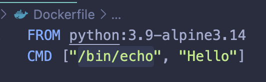
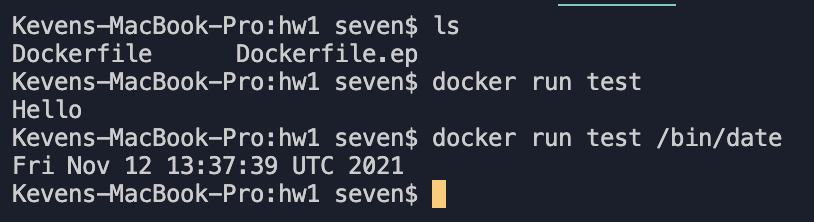
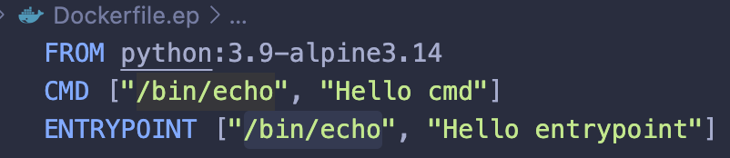
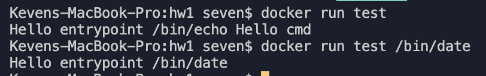

## Indica la diferencia entre el uso de la instrucción CMD y ENTRYPOINT (Dockerfile).

La diferencia es que la instrucción CMD se puede sobreescribir mientras que ENTRYPOINT no se puede.

**CMD**

**ENTRYPOINT**

