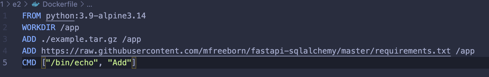
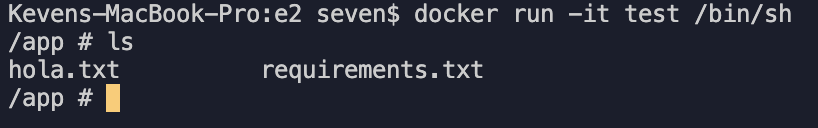

## Indica la diferencia entre el uso de la instrucción ADD y COPY (Dockerfile).

La diferencia es que ADD permite hacer más cosas que simplemente copiar la carpeta o archivo (COPY). ADD nos permite copiar desde una url y descomprimir formatos como identity, gzip, bzip2 or xz .

