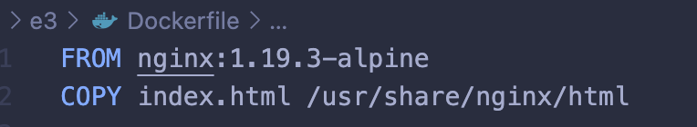
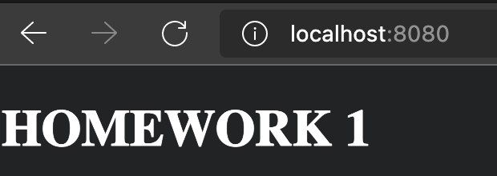
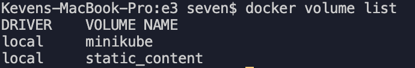

## Crea un contenedor con las siguientes especificaciones:

**a. Utilizar la imagen base NGINX haciendo uso de la versión 1.19.3**

**b. Al acceder a la URL localhost:8080/index.html aparecerá el mensaje HOMEWORK 1**

**c. Persistir el fichero index.html en un volumen llamado static_content**

Dockerfile:



Primero construimos la imagen con el comando:
```jsx
docker build -t image-3 -f Dockerfile .
```
Luego ejecutamos el comando para crear el contenedor container-3 en base a la imagen image-3, considerando el volumen static_content que mapeara a la carpeta donde se encuentra el index.html. No se definirá el volumen dentro del Dockerfile por tema de portabilidad y hacer lo más stateless posible.
```jsx
docker run -d -p 8080:80 --name container-3 --rm -v static_content:/usr/share/nginx/html image-3
```




