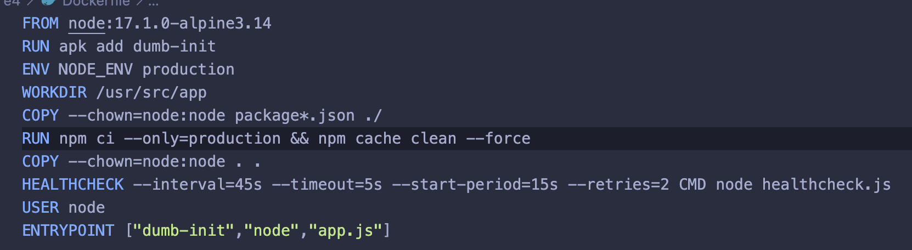
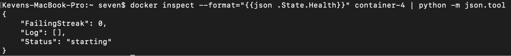
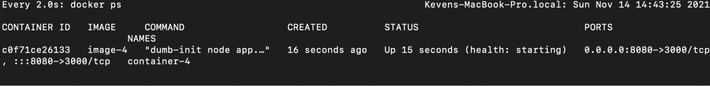
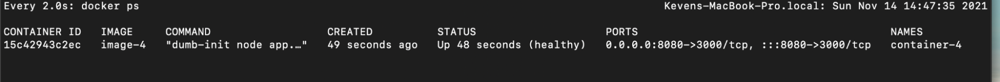
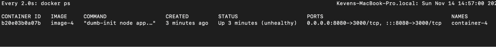
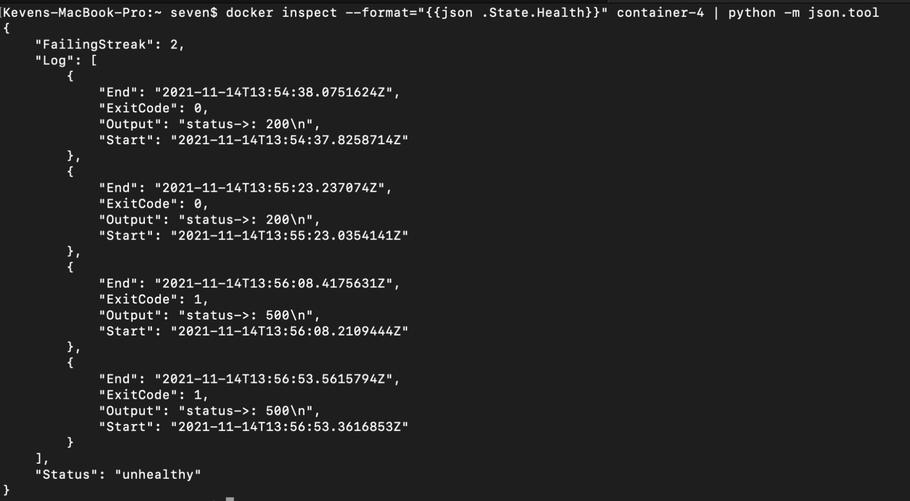

## Crea una imagen docker a partir de un Dockerfile. Esta aplicación expondrá un servicio en el puerto 8080 y se deberá hacer uso de la instrucción HEALTHCHECK para comprobar si la aplicación está ofreciendo el servicio o por si el contrario existe un problema.

**El healthcheck deberá parametrizarse con la siguiente configuración:**

- **La prueba se realizará cada 45 segundos**
- **Por cada prueba realizada, se esperará que la aplicación responda en menos de 5 segundos. Si tras 5 segundos no se obtiene respuesta, se considera que la prueba habrá fallado**
- **Ajustar el tiempo de espera de la primera prueba (Ejemplo: Si la aplicación del contenedor tarda en iniciarse 10s, configurar el parámetro a 15s)**
- **El número de reintentos será 2. Si fallan dos pruebas consecutivas, el contenedor deberá cambiar al estado “unhealthy”)**

Consideraciones para Dockerfile:

- Se copia de forma separada el package.json y package-lock.json porque si cambiamos el código fuente (app.js o su hubiera más) no es necesario que se vuelva a instalar todas librerías e invalide la caché.
- Se crea el archivo ​​.dockerignore para ignorar el node_modules.
- Se configuran los parámetros dado las condiciones del ejercicio y se realiza el request usando la misma api de node js para no depender una librería como curl y aprovechar la imagen base .
- Evitamos el usuario root.

Al iniciar

A los 45 segundos pasa a estado healthy

Probando option retry 2, las dos ultimos ultimos request se programó que retorne error después de cierto tiempo con status 500,  una vez detecta el segundo error el container pasa a estado unhealthy.

