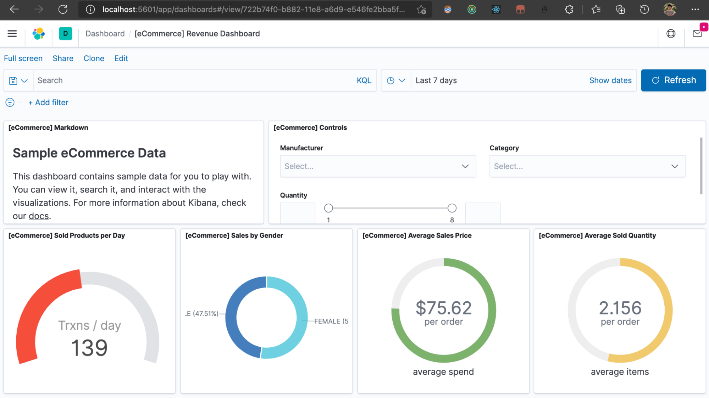

## Utilizar una solución  basada en contenedores donde levantaréis el motor de indexación (ElasticSearch) y la herramienta de visualización (Kibana).

Resultado ingresando http://localhost:5601/ y cargando la data de ejemplo.

